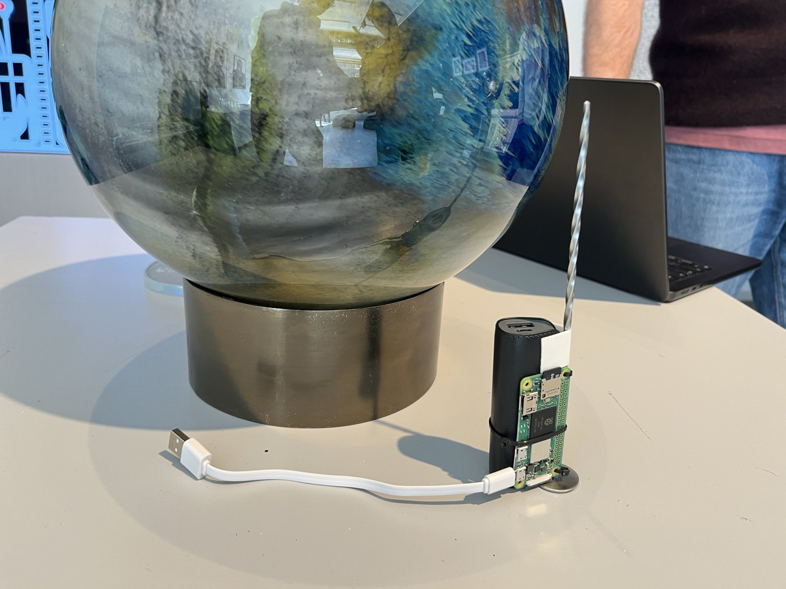

# Copernicus Sphere II (moon)

# DEPLOYED ON 10/4/2025

```
COPERNICUS II
Created: 2025-04-10T16:29:59.660Z
Address: bc1p8ql9nwwz9lsmjt0ews26nvyf2rxemdq00dl4gh47ml3jvxnuzz7qdfrq5v
```

<div align="center">
  
  
</div>

# Preparing the Raspberry Pi

- Launched on pi zero w2 using a 8GB sd card
- 2600 mah powerbank (make sure it fits through the hole D ca 4cm, use a compact usb cable connector)
- Ubuntu 22 LTS (Headless)

  - set system name to copernicus
  - enable ssh at install time
  - install wifi connection at launch time
  - create user copernicus
  - after install, add ssh key for development laptop to ~/.ssh/authorized_keys or run ssh-copy-id copernicus@copernicus.local
  - create a 2GB+ swap file otherwise the npm install will fail

- Internet connection via pre-configured local network
  - preferably use a travel router like TP-LINK AC (https://www.tp-link.com/nl/home-networking/wifi-router/tl-wr902ac/) to develop and easy deploy on-site (no reconfiguration of the pi required onsite)
- Install nvm and set to node V22
- Install pm2 and setup a deamon that launches on start

  - sudo npm install -g pm2
  - pm2 startup -> creates script, execute this script on the cls
  - setup script adds the app to pm2

- Install Bun using the official installer (dev laptop) to deploy:

```bash
curl -fsSL https://bun.sh/instally | bash
```

- Deployment to Raspberry Pi
  - current .env file is hardcoded into the app, make sure to setup for the pi before building the next app
  - use the deploy.sh script via bun run deploy

The application will be available at `http://your-raspberry-pi-ip:3000`

# launch script Copernicus II

## physibles

- double sided strong tape
- tie wraps
- hdmi monitor (for rPi test) + hdmi mini->normal connector
- keyboard + mini -> standard usb converter
- large powerbank for pre-event testing

## pre-event actions

- install unisat browser extension on the deployment laptop
- add sufficient bitcoin to the unisat wallet for the deploy
- deploy last version to raspberry pi
- setup travel router raspberry pi to use gallery wifi
- check destination address
- run single launch in test mode
- check mempool status / current deploy vsat rates

## nice to have for future cases:

- dynamic switching between test and final deploy settings in the app so no deploy is necessary to switch
- indication of the required amount of BTC for launch
  - add to pre-launch script: run a full deploy order (with final ordinal data), note number of sats, for now there is no call that does this without launching the order on the uniSat api
- compact cable (90 degree connector) for a better fit through the hole

## ordinal optimization

- see copernicus-ordinals-template-design folder

## useful links

- https://open-api-fractal.unisat.io/swagger.html
